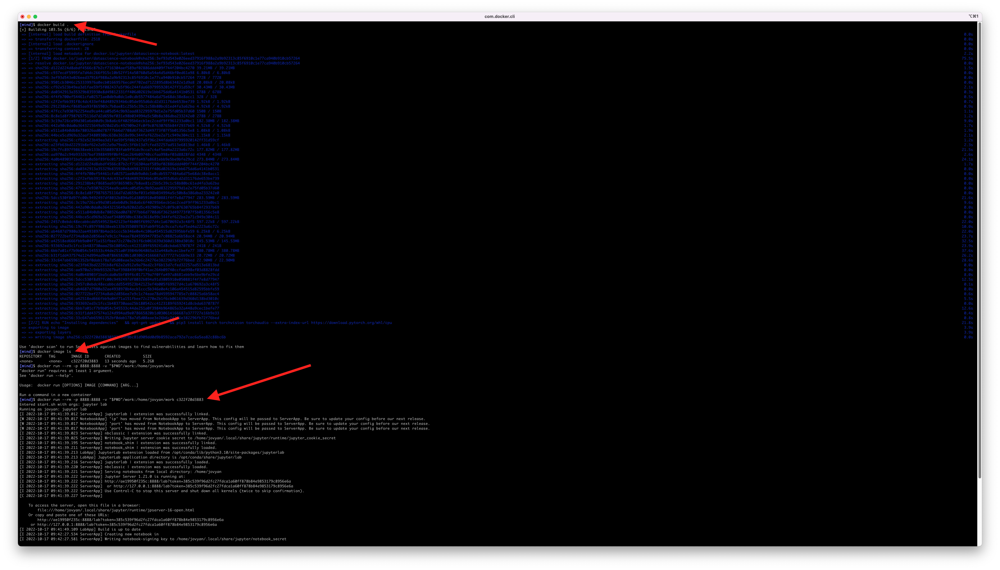
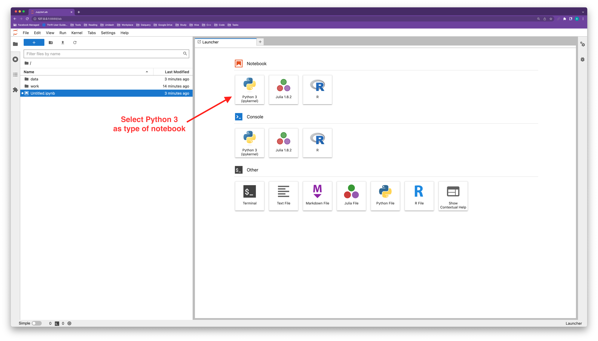
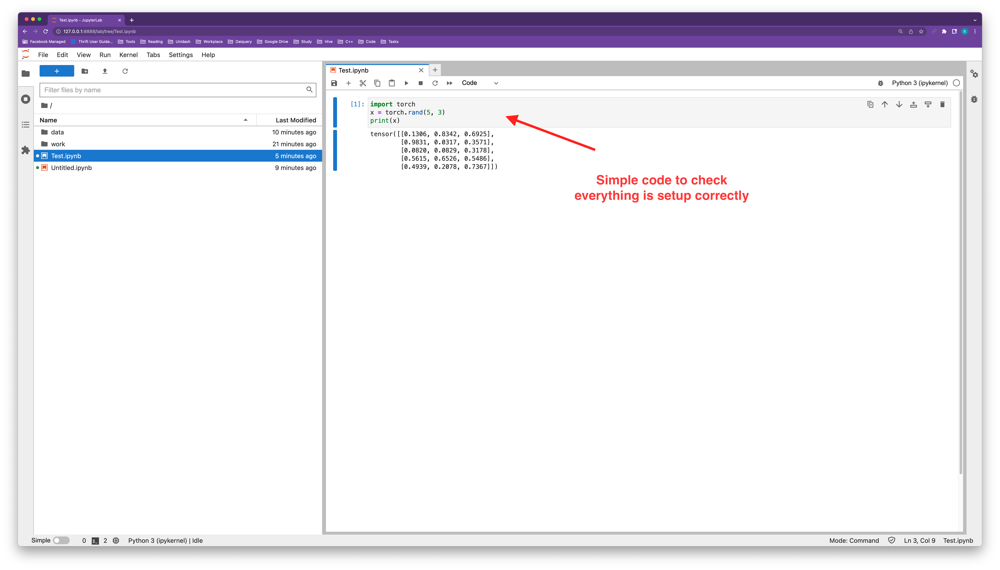
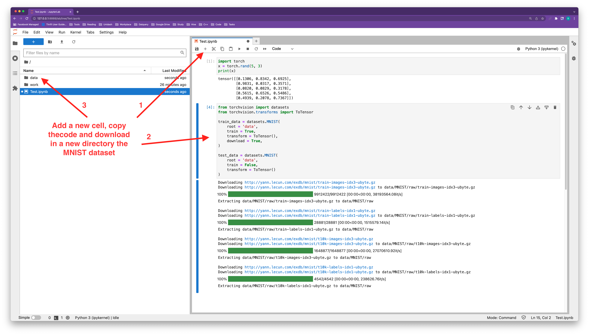
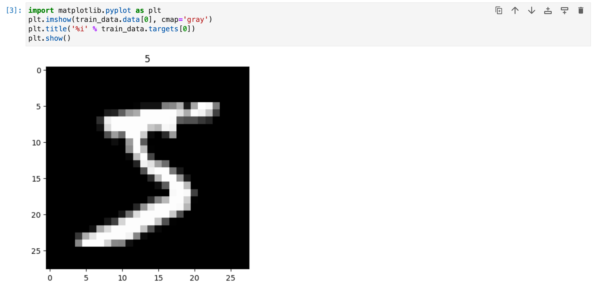

## Machine Mind

Repository about Machine Learning and Deep Learning.

```sh
$ git clone https://github.com/besarthoxhaj/mind.git
$ cd mind/
$ mkdir work
$ docker builder prune
$ docker build . -t mind
$ docker run --rm -p 8888:8888 -v "$PWD"/work:/home/jovyan/work mind
# Entered start.sh with args: jupyter la
# ...
# http://127.0.0.1:8888/lab
```



## Jupyter Notebook

Once inside the Jupyter Notebook select "Python 3" as notebook. Then
write and execute a simple command to check everything is ok.



```py
import torch
x = torch.rand(5, 3)
print(x)
```



Great! Seem everything is working as expected. Let's try now to download
the MNIST dataset and run a CNN (Convolutional Neural Network).

```py
from torchvision import datasets
from torchvision.transforms import ToTensor

train_data = datasets.MNIST(
    root = 'data',
    train = True,
    transform = ToTensor(),
    download = True,
)

test_data = datasets.MNIST(
    root = 'data',
    train = False,
    transform = ToTensor()
)
```



Check if the images are there with matplot library.

```py
import matplotlib.pyplot as plt
plt.imshow(train_data.data[0], cmap='gray')
plt.title('%i' % train_data.targets[0])
plt.show()
```



If also the last step worked you are all set. Just follow the resources.
Or simply search for simple neural networks to do anything, the internet
it's full of them.

## Resources

1. 3Blue1Brown: https://www.youtube.com/playlist?list=PLZHQObOWTQDNU6R1_67000Dx_ZCJB-3pi
2. PyTorch get started: https://pytorch.org/get-started/locally
3. Google Colab: https://colab.research.google.com
3. PyTorch tutorial: https://pytorch.org/tutorials/beginner/basics/quickstart_tutorial.html
