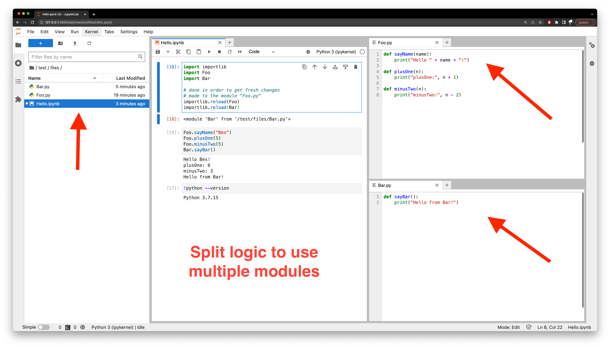
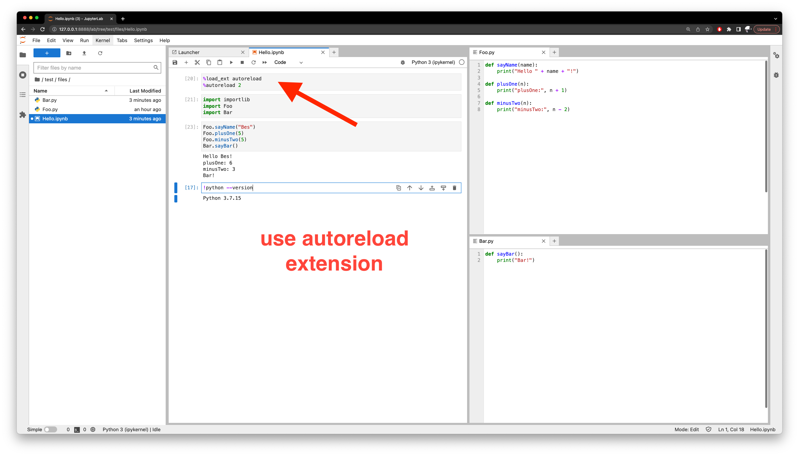

# Jupyter Lab Files

 

## Resources
- https://support.enthought.com/hc/en-us/articles/204469240-Jupyter-IPython-After-editing-a-module-changes-are-not-effective-without-kernel-restart
- https://ipython.readthedocs.io/en/stable/config/extensions/autoreload.html
- https://stackoverflow.com/questions/1254370/reimport-a-module-while-interactive